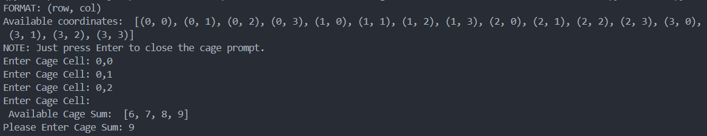
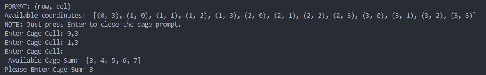
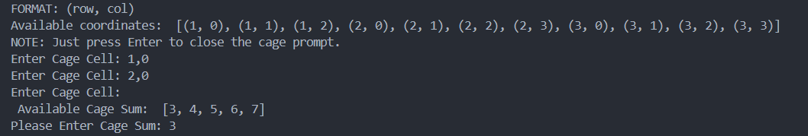
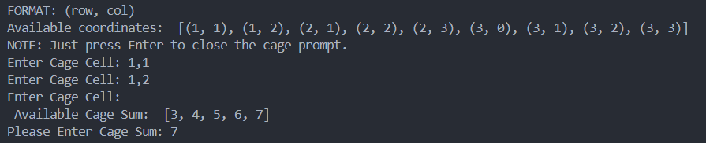
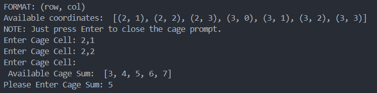
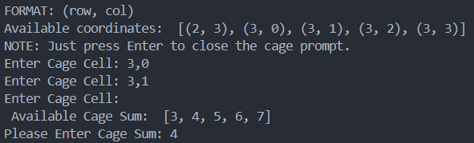
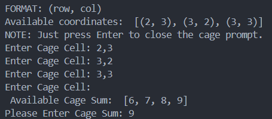
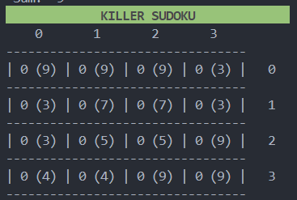
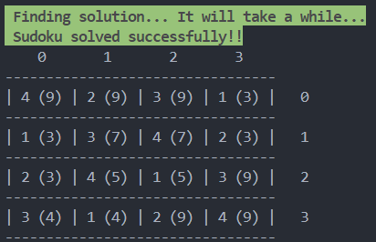
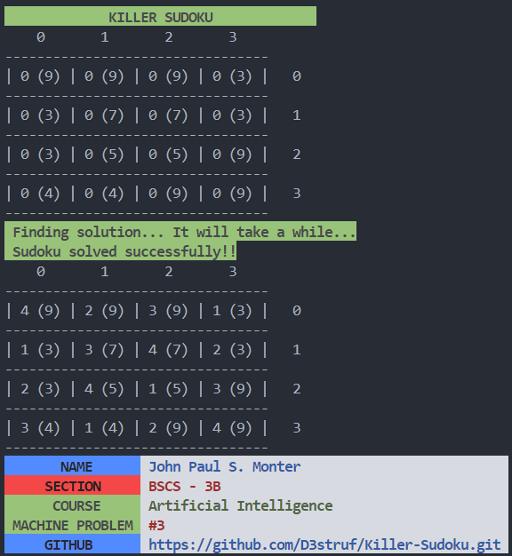

# 4x4 Killer Sudoku Solver with Back-Jumping Algorithm

## What's New?

- This new application for solving 4x4 Killer Sudoku puzzles incorporates the Back-Jumping algorithm, enhancing efficiency and performance in finding solutions. Back-Jumping is a constraint satisfaction algorithm that allows for intelligent backtracking, reducing unnecessary search space exploration and improving the speed of solving complex puzzles.

## Documentation

### Sample Usage

#### Cage cells: `((0, 0), (0, 1), (0, 2))` Cage Sum: `9`

#### Cage cells: `((0, 3), (1, 3))` Cage Sum: `3`

#### Cage cells: `((1, 0), (2, 0))` Cage Sum: `3`

#### Cage cells: `((1, 1), (1, 2))` Cage Sum: `7`

#### Cage cells: `((2, 1), (2, 2))` Cage Sum: `5`

#### Cage cells: `((3, 0), (3, 1))` Cage Sum: `4`

#### Cage cells: `((2, 3), (3, 2), (3, 3))` Cage Sum: `9`

#### Cage Matrix

#### Solution Found

#### Overall Results

