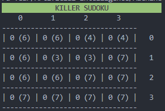
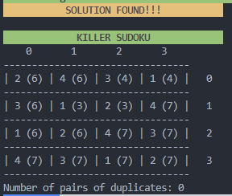
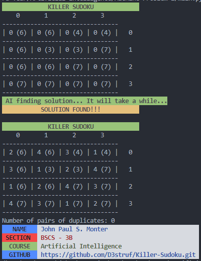

# Killer-Sudoku-Solver
Killer Sudoku Problem Solver Agent using Hill Climbing Algorithm

## Overview
This Python program solves the Killer Sudoku puzzle, a variant of the classic Sudoku puzzle. The solver incorporates both user input for defining cage sums and an AI-based hill climbing algorithm to find a solution.

## Features
- User-friendly interface for inputting cage sums and coordinates.
- Utilizes the hill climbing algorithm to iteratively improve the solution.
- Validates the generated matrix to ensure it meets Killer Sudoku rules.
- Provides detailed feedback on the number of duplicate pairs found.

## Hill Climbing Algorithm

### Explanation

Hill Climbing is a local search algorithm that continuously moves towards the direction of increasing elevation (or improvement) to find the peak of the mountain, metaphorically speaking. In the context of this Killer Sudoku solver, the "elevation" represents the number of duplicate pairs in the puzzle.

### Step-by-Step Guide

1. **Evaluation:**
    - Evaluate the current state by counting the number of duplicate pairs in rows, columns, and subgrids.

2. **Move Generation:**
    - Randomly select a cage and swap two numbers within it.

3. **New Evaluation:**
    - Reevaluate the state after the swap to see if the number of duplicates decreases.

4. **Acceptance Criterion:**
    - If the new state has fewer duplicates or remains the same, accept the move. Otherwise, undo the swap.

5. **Repeat:**
    - Repeat steps 2-4 for a specified number of iterations or until no improvement is possible.

## Instructions

- Clone the repository: `git clone https://github.com/D3struf/Killer-Sudoku.git`
- Navigate to the project directory: `cd Killer-Sudoku`
- Run the Python script: `python killer_sudoku.py`
- Follow the prompts to input cage sums and coordinates.
- Wait for the solver to find a solution.

## Requirements

- Python 3.x
- colorama (for colored output)
- itertools (for generating combinations)

## Usage

1. When prompted, enter the coordinates of each cage cell in the format (row, col).
2. Input the sum for each cage, ensuring it adheres to Killer Sudoku rules.
3. The program will generate an initial matrix and attempt to solve it using the hill climbing algorithm.
4. Once a solution is found, the final matrix will be displayed along with the number of duplicate pairs.

## Documentation

### Killer Sudoku after user inputs

### AI loading and looking for the solution

### AI found the solution using the algorithm described

### Overall Results

## Credits

- Developer: [John Paul S. Monter](https://github.com/D3struf)
- Course: Artificial Intelligence
- GitHub: [Killer-Sudoku Repository](https://github.com/D3struf/Killer-Sudoku.git)